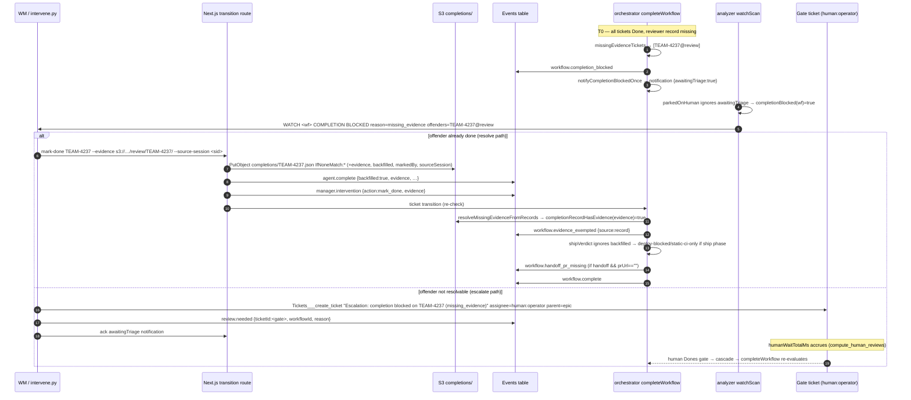
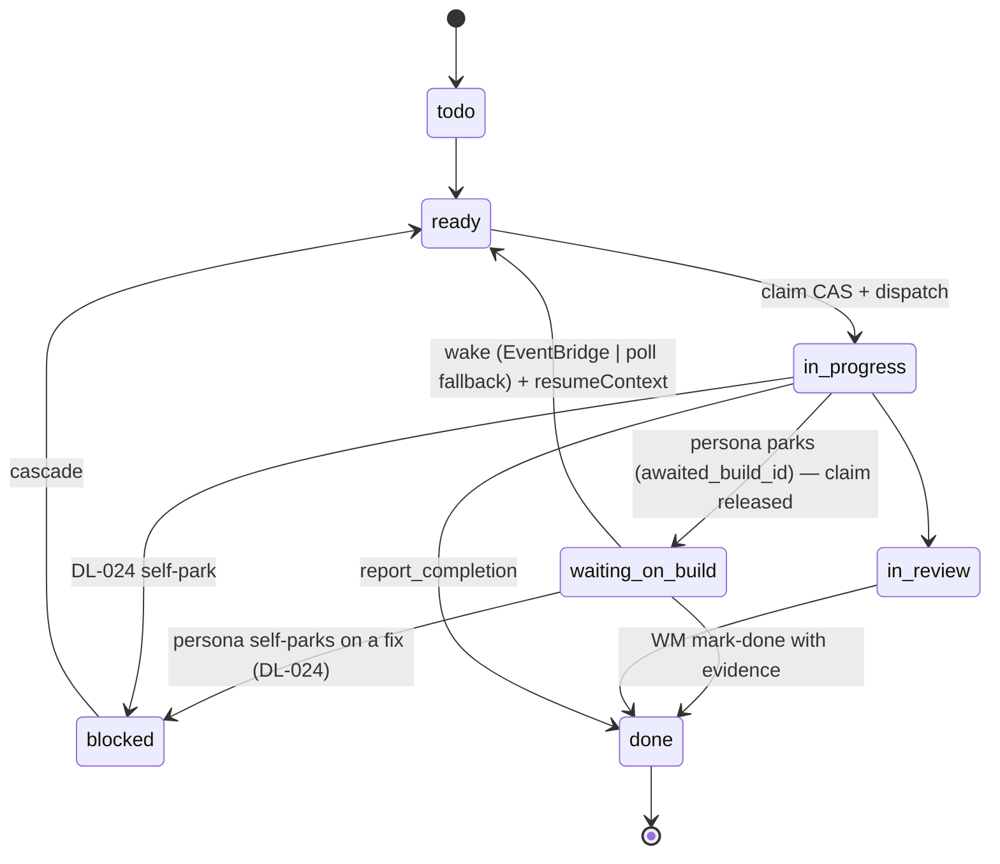
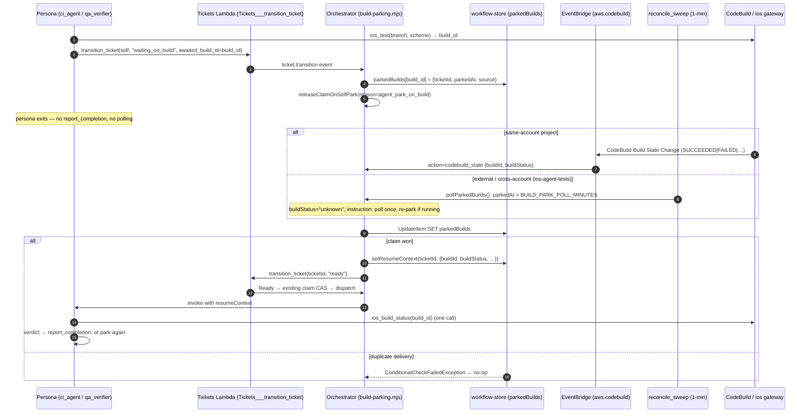

# Honest Close, Runtime Heartbeat/Watchdog, One-Live-Proof + Build Parking — Architecture Design

| Field | Value |
|---|---|
| Workflow | `wf_1788901936774_elurvy` |
| Epic | TEAM-4297 (SI: system honest close / mark-done satisfies gate) |
| Ticket | TEAM-4300 (architecture design) |
| Branch | `feature/TEAM-4297--si-system-honest-close-mark-done-satisf` |
| Date | 2026-09-08 |
| Status | DESIGN — ready for Dev-A / Dev-B / Dev-C |
| Inputs | FR-1..FR-18 (`workflows/wf_1788901936774_elurvy/shared/requirements.md`); replays 8grdyv, 463811, sr2pbx (2026-09-07) |

**Summary.** Three dead-code-sweep runs on 2026-09-07 exposed three independent gaps. (1) 8grdyv was un-closable for 29 h: the reviewer died after posting its review, the WM mark-done'd the ticket, the completion-evidence gate 409'd on `missing_evidence`, and the resulting `manager_escalation` notification made the analyzer treat the run as "parked on human" for 14 h — nobody looked. (2) 463811's `ci_agent` burned $1,050 / 91 M tokens polling seven 40-minute single-slot iOS CodeBuild runs. (3) sr2pbx ran a fix concurrently with QA, and a `claude_code` sub-session wedged 25 min on an IAM `AccessDenied` uploading QA evidence. This document designs three modifications to EXISTING surfaces — **D1 honest close**, **D2 runtime heartbeat/watchdog + dead-session fast path**, **D3 one-live-proof manifest + build parking + fix-before-verify + fix-kind enforcement + IAM** — with no new service, Lambda or table, and reconciled against the in-flight DL-009 cleanup series.

> **Doctrine reconciliation (read first).**
> - **DL-009 (PR #451)** — the orchestrator is a thin event router: claim → dispatch → cascade → reap → evaluate completion. "Anything deciding what work happens next … lives in blueprints via ticket tools … never in the orchestrator, and never behind a new `*_MODE` env flag." CI (`scripts/check-orchestrator-surface.sh`) fails on any module not in `scripts/orchestrator-modules.allow`, env var not in `scripts/orchestrator-env.allow`, stale zip line, or LOC over budget (12 200 total / 5 150 `index.mjs` after cleanup PR 2). These three files exist **only on `origin/chore/orchestrator-doctrine-guard`** today (verified with `git show`); they are absent on `main`.
> - **DL-024 (PR #451 text, #452 tool, #455 blueprints)** — agent self-park: `Tickets___transition_ticket(self, "blocked", blocked_by=<fix>)`; orchestrator only releases the claim (`releaseClaimOnSelfPark`, event `orchestrator.claim_released reason=agent_self_park`) and later cascades.
> - **PR #435** — mark-done writes `completions/{ticketId}.json` create-only (`IfNoneMatch: "*"`, fill-if-blank `IfMatch`, revert on refused transition). D1 **layers** on it; nothing here re-implements that write.
> - **PR #454** deletes `ticket-blockers.mjs`, `live-reverify.mjs`, `merge-on-green.mjs`, `sync-main.mjs`, `rework-loop-cap.mjs`, `dead-session-escalation.mjs`, `ci-check.mjs`, `ship-*.mjs`, `model-router.mjs` and removes `addBlockers` / `transitionTicketStatus` from `index.mjs`. Also deletes `replay-yteqfl-dead-session.test.mjs`.
> - **PR #448** parks the Ship ticket on ship fixes; touches `cascade.mjs:cascadeUnblock` (L183-310) and `index.mjs` L1687 / L3719.
>
> **What this design drops or re-scopes as a result:** `HONEST_CLOSE_MODE` (dropped → pure `completion.mjs` change + `workflow.evidence_exempted` event); `FIX_BEFORE_VERIFY` and the orchestrator-side blocker injection in `cascadeUnblock` (dropped → delivered by DL-024 self-park in #452/#455; Dev-C ships only a replay test); `ONE_LIVE_PROOF` env flag (→ workflow-def field `fleet.liveProof`); `PARK_ON_BUILD` (→ deploy-time switch that creates an EventBridge rule, not an orchestrator env read). The ONE new orchestrator module, `build-parking.mjs`, is routing/claim/dispatch plumbing (it re-Readies a ticket; the persona decides everything else) and enters the allow-list with a **DL-025** entry in the same PR.

---

## 1. Scope & non-goals

**In scope (modify existing):** `lambda/orchestrator/{completion.mjs,index.mjs,dead-session-detector.mjs,fix-contract.mjs,workflow-store.mjs,deploy.sh,template.yaml}` + one new module `build-parking.mjs`; `lambda/workflow-analyzer/index.mjs`; `deploy/runtime-agent/main.py`; `src/app/api/workflow/[id]/tickets/transition/route.ts`; `src/app/api/workflow/[id]/complete/route.ts`; `src/lib/workflow/{completion-evidence.ts,lease.ts,types.ts,workflow-defs.ts}`; `src/config/{lease-constants.json,workflows.json}`; `lambda/agentcore-hub-tickets/index.mjs`, `lambda/agentcore-hub-jira/index.mjs`; `deploy/workflow-manager/toolkit/{intervene.py,compute_metrics.py}`; `deploy/coding-agent-runtime/setup-coding-runtime-role.sh`; `blueprints/{qa-verifier,ci-agent,code-sweeper}.md`; `scripts/verify-infra.sh`; `docs/workflow-pipeline-architecture.md` (DL-025).

**Non-goals.**
- No new service, Lambda, DynamoDB table, or cron. The sweep cron is already `rate(1 minute)` (`lambda/orchestrator/deploy.sh` `SWEEP_RATE`, TEAM-4060). The ~11 min dead-session lag is `computeThreshold` = `clamp(3 × median, LEASE_TTL_MS=30 min, 6 h)` plus the absence of an `agent.error` fast path — fixed in FR-12, not by cron.
- **ios-agent-tests buildspec: OUT OF SCOPE.** It is not in this repo (`deploy/config.sh` `IOS_TEST_GATEWAY_URL` is an external AgentCore Gateway; only `deploy/pipeline/buildspec-{ci,deploy,runtime-images}.yml` exist). File to the owning repo. FR-15 parking makes the hub resilient to slow external builds regardless of whether that buildspec ever changes. Because the external CodeBuild project may live in another account, EventBridge `CodeBuild Build State Change` events only arrive for same-account projects (`agentcore-hub-ci`, `agentcore-hub-deploy`); §4.2 handles both the event path and a poll fallback.
- No redesign of the dead-code-sweep def's ship phase for handoff runs (FR-7 only makes the gap visible; tracked as a follow-up SI).
- No loosening of any completion gate beyond "mark-done **with evidence**".

---

## 2. D1 — Honest close (FR-1..FR-8)

### 2.1 Record & event contracts

**`completions/<ticketId>.json` (extends PR #435, same create-only write):**
```json
{
  "ticketId": "TEAM-4237", "workflowId": "wf_…8grdyv", "agentId": "code_reviewer", "phase": "review",
  "summary": "…", "pr_url": null, "commit_sha": null, "artifacts": [],
  "evidence": "s3://<bucket>/workflows/wf_…8grdyv/shared/review/TEAM-4237/  |  https://github.com/…/pull/12#pullrequestreview-…",
  "markedBy": "workflow-manager", "backfilled": true,
  "sourceSession": "<dead AgentCore session id>", "at": "2026-09-07T…Z"
}
```
Rules: `pr_url` / `commit_sha` stay `null` unless the WM supplies real values — **never synthesised**. Absent `backfilled` reads `false` (pre-D1 records). `evidence` is an S3 prefix or a PR-review URL, non-empty string.

**Events (all additive, events table, no schema change):**

| Type | Publisher | Detail |
|---|---|---|
| `agent.complete` (existing type, new fields) | Next.js transition route (mark-done path) | `{workflowId, ticketId, agentId, phase, backfilled:true, markedBy:"workflow-manager", sourceSession, evidence}` |
| `workflow.evidence_exempted` | `completeWorkflow` | `{workflowId, ticketId, source:"record"\|"intervention", evidence}` |
| `workflow.forced_complete` | Next.js complete route | `{workflowId, reason, forcedBy:"workflow-manager", clearedGate:"missing_evidence", offenders[], at}` |
| `workflow.handoff_pr_missing` | `completeWorkflow` | `{workflowId, featureBranch, reason:"def_has_ship_phase"\|"pr_step_failed"\|"forced_close", epicId}` |
| `workflow.completion_blocked` (existing) | `notifyCompletionBlockedOnce` | unchanged; notification row gains `awaitingTriage:true` |
| `review.needed` (existing) | intervene.py escalation | `{ticketId:<gate>, workflowId, reason:"completion_blocked:missing_evidence"}` |

### 2.2 Functions that change, per file

| File | Function | Change |
|---|---|---|
| `deploy/workflow-manager/toolkit/intervene.py` | `cmd_mark_done` (L224) | New args `--evidence` (required for the gate to honour it), `--source-session`; payload adds `evidence, markedBy:"workflow-manager", backfilled:true, sourceSession`. Still publishes `manager.intervention {action:"mark_done", ticketId, evidence}` as today. |
| `src/app/api/workflow/[id]/tickets/transition/route.ts` | `POST` — the Lambda-invoke block (L110-150) where #435 adds the completions write | Pass `evidence/markedBy/backfilled/sourceSession` **through to the SAME create-only `PutObject`** (no second write path). After a successful transition AND successful (or already-exists) record write, call new route-local helper `publishMarkDoneComplete(workflow, ticket, fields)` → one `PutItem` to `EVENTS_TABLE` of type `agent.complete` with the FR-2 detail (Next.js already holds DDB access via `@/lib/workflow/dynamo-read`; event id follows `lambda/orchestrator/event-id.mjs` convention `evt_<ts>_<rand>`). This satisfies `completionRequiresAgentPhases` without any orchestrator change. If #435's write is refused (record exists, no blanks to fill), the event is still published with `evidence` — the FR-3(b) fallback then covers the gate. |
| `lambda/orchestrator/completion.mjs` (+ TS twin `src/lib/workflow/completion-evidence.ts`; parity pinned by `completion-evidence-parity.test.ts`) | `completionRecordHasEvidence` (L198) | (a) additionally returns `true` for `nonEmptyString(record.evidence)`. Pure; no env read. `resolveMissingEvidenceFromRecords` (L243) therefore rescues the ticket unchanged. |
| same | `missingEvidenceTickets` (L147) | (b) new `opts.interventions` (array of `manager.intervention` events, supplied by caller): exempt a done ticket that has `{action:"mark_done", ticketId, evidence:<non-empty>}`. Mark-done **without** evidence still blocks. Returns each exemption with `source` so the caller can publish `workflow.evidence_exempted`. |
| same | `evidenceBackfillFields` (L216) | **Unchanged** (fill-only-if-missing; never `mergeCommit/outcome/blockReason`). |
| same | `shipVerdictOf` (L466) / `evaluateShipVerdict` (L498) | Ignore any agentTasks entry / record with `backfilled === true` for the *shipped* verdict (TEAM-3755 F1): a backfilled ship-phase close yields `deploy-blocked` / `static-ci-only`, never a false `shipped`. TS twin in `complete/route.ts:shipVerdictOf` (L245) mirrors. |
| `lambda/orchestrator/index.mjs` | `completeWorkflow` evidence gate (L4044-4123) | Pass `manager.intervention` events (already loaded for the run) into `missingEvidenceTickets`; when a ticket is exempted publish `workflow.evidence_exempted`. |
| same | `notifyCompletionBlockedOnce` (L3962) | Notification row gains `awaitingTriage: true` (one field; no flag). |
| same | `completeWorkflow` unified-PR block (L4279) + publish (L4325) | FR-7: if `delivery.mode === "handoff"` and `prUrl === ""`, publish `workflow.handoff_pr_missing` with `reason` = `def_has_ship_phase` when `defHasShip` (structurally skipped), `pr_step_failed` when the `create_pr` catch fired, `forced_close` when the run carries a `workflow.forced_complete` event. Then publish `workflow.complete` as today. |
| `lambda/workflow-analyzer/index.mjs` | `parkedOnHuman` (L304), `watchScan` (L310), new `completionBlocked(wf)` | §2.3. |
| `src/app/api/workflow/[id]/complete/route.ts` | `POST` — `missing_evidence` 409 (L600) | §2.5 force path. |
| `deploy/workflow-manager/toolkit/compute_metrics.py` | `compute_human_reviews` (L265) | Unchanged logic; FR-6 gate ticket shape is chosen so it is counted. Add `waiting_on_build` to the non-terminal status map (§9). |

### 2.3 The self-suppression loop (FR-5)

**Today:** `notifyCompletionBlockedOnce` appends an unacknowledged `manager_escalation` (`notif_completion_evidence_<wf>`). Analyzer `parkedOnHuman` (L304-307) treats *any* unacknowledged `review_needed | manager_escalation` as "a human owns this", so `watchScan` skips the run. The block notification guarantees nobody looks.

**Fix (four coordinated edits, one field, one analyzer flag):**
1. Orchestrator: the completion-evidence notification carries `awaitingTriage: true`. Nothing else changes in `notifyCompletionBlockedOnce`.
2. Analyzer `parkedOnHuman(wf)`: ignore notifications where `n.awaitingTriage === true` **or** `String(n.id).startsWith("notif_completion_evidence_")` (legacy rows). Keep the `manager_escalation` clause for genuine gates (dead-session exhaustion, ship review).
3. Analyzer new predicate `completionBlocked(wf, events)`: newest `workflow.completion_blocked` with no later `workflow.complete` and no acknowledged completion-evidence notification ⇒ **immediate WATCH candidate, ignoring `STALE_MS`**. KEEP the `COOLDOWN_MS` check (L328-329) and the `wmLastWatchAt` conditional claim (L342) — no double-watch.
4. WATCH prompt line: `WATCH <id> … COMPLETION BLOCKED reason=missing_evidence offenders=TEAM-4237@review` so watch-triage takes the resolve path.
5. Same-pass resolution in the WM: offender ticket already Done ⇒ `intervene.py mark-done --evidence <s3 prefix|review url> --source-session <id>` (FR-1/2) → transition route re-Dones / re-checks → `completeWorkflow` re-runs the gate. Otherwise escalate (FR-6).

Analyzer flag `WATCH_ON_COMPLETION_BLOCKED` (on|off, default on) lives in the **analyzer** Lambda env — not the orchestrator.

### 2.4 Escalation as a real human gate (FR-6)

`compute_human_reviews` counts a wait only when the ticket assignee starts with `human:` **and** a `review.needed` event or `review_needed` notification carries its `ticketId`. So the WATCH escalation (intervene.py, WM toolkit — not orchestrator) creates a **gate ticket** via `Tickets___create_ticket`: title `Escalation: completion blocked on <offender> (missing_evidence)`, `assignee: human:operator`, `parent_id: <epic>`, `ticket_type: task`, `labels: completion_gate`. The epic's completion already waits on all non-epic children (`complete/route.ts` L120 `openChildren`, orchestrator `isWorkflowComplete`), so the gate is blocking with **no new orchestrator path**. intervene.py then publishes `review.needed {ticketId:<gate>, workflowId, reason}` and acknowledges the `awaitingTriage` notification (existing notification-ack API). The 29 h now lands in `humanWaitTotalMs`. The human resolves by Done-ing the gate ticket (or mark-done with evidence + complete).

### 2.5 `complete --force --reason` (FR-4) — request/response contract

Implemented ONLY in `src/app/api/workflow/[id]/complete/route.ts` and `intervene.py:cmd_complete` (L213). Next.js env `COMPLETE_FORCE_ENABLED` (default off).

```
POST /api/workflow/{id}/complete
{ "force": true, "reason": "8grdyv: reviewer died after posting review; evidence at s3://…/review/TEAM-4237/" }
```

| Condition | Response |
|---|---|
| `force` absent/false | Exactly today's behaviour. |
| `force: true`, `COMPLETE_FORCE_ENABLED` unset/off | **409** `{error:"missing_evidence", tickets, forceDisabled:true}` (unchanged gate). |
| `force: true`, `reason` missing / empty / whitespace | **400** `{error:"reason_required"}`. |
| `force: true`, enabled, run already terminal (L96-104 `terminalPhaseGuard`, 409s at L385/L485/L492) | **409** unchanged — force never touches this. |
| `force: true`, enabled, open non-epic children (L524) | **409** unchanged — force never clears all-children-done. |
| `force: true`, enabled, ship verdict missing (L635) or `closeBlocked` (L347-436) | **409** / honest terminal close unchanged — force never clears these. |
| `force: true`, enabled, ONLY the L600 `missing_evidence` gate fails | **200** `{status:"complete", forced:true, clearedGate:"missing_evidence", offenders[]}`; publishes `workflow.forced_complete`; the run's `delivery`/ship outcome is computed as if the offenders were `backfilled:true` (so §2.2 verdict rule applies). |

Narrow by construction: the force branch is `if (force && FORCE_ENABLED && missing.length) { publish forced_complete; continue past L600 only }`. The Tier-2 security reviewer owns this path (§6).

### 2.6 Sequence — 8grdyv honest-close replay (FR-8)

Replay test: `lambda/orchestrator/replay-8grdyv-honest-close.test.mjs`, modelled on `replay-gate-state.test.mjs` / `replay-d1..d3.test.mjs` (NOT `replay-yteqfl-dead-session.test.mjs`, deleted by #454). Fixture: reviewer `agent.started` → `agent.streaming` → review posted → session dies → WM `mark_done` → gate 409 → `completion_blocked` → analyzer WATCH → resolve or escalate.



---

## 3. D2 — Runtime heartbeat & watchdog (FR-9..FR-13)

### 3.1 Bedrock read timeout & in-session retry (FR-9)

`deploy/runtime-agent/main.py:_build_bedrock_model` (L324) today passes `read_timeout=READ_TIMEOUT` (L153, default 1200 s). Change: `BEDROCK_READ_TIMEOUT_S` (default 150, clamped 60–1200); `READ_TIMEOUT` honoured as a deprecated alias for one release with a startup warning. `BotocoreConfig(read_timeout=…, retries={"max_attempts": 2, "mode": "standard"})`.

**botocore facts (docstring):** `read_timeout` is the per-read socket timeout — the maximum seconds between two consecutive bytes — **not** a total deadline; a streaming Converse call can legitimately run for many minutes while emitting bytes. botocore's retry handler does **not** re-drive a partially consumed event stream (`EventStreamError` / `ReadTimeoutError` mid-stream surface to the caller). Hence the retry must be at the **Strands turn level**: wrap the `agent.stream_async(prompt)` loop in the detached run path (main.py L3312) in `_run_turn_with_retry()`: `BEDROCK_RETRY_ATTEMPTS` (default 2), jittered exponential backoff 5 s → 30 s, retrying only on `ReadTimeoutError`, `EventStreamError`, and `ClientError` with code `internalServerException` (ConverseStream). Each retry publishes `agent.heartbeat {phase:"model_call", retry:n}`; exhaustion publishes ticket-keyed `agent.error {reason:"bedrock_retry_exhausted"}`.

### 3.2 `agent.heartbeat` (FR-10)

```json
{ "type":"agent.heartbeat", "workflowId":"wf_…", "ticketId":"TEAM-…", "agentId":"qa_verifier", "sessionId":"…",
  "phase":"model_call|tool_call|subsession_poll", "toolName":"ios_build_status", "at":"2026-09-08T…Z", "seq": 17 }
```
Emitted on model-call start/return and every tool return, including `codex` / `claude_code` sub-session polls and `ios_build_status` polls. **Coalesced ≤ 1 per `HEARTBEAT_MIN_INTERVAL_S` (default 10) per session** via a monotonic-clock guard in `_publish_event` (main.py L3189, already stamps `_CURRENT_TICKET_ID` at L3203). `HEARTBEAT_ENABLED` on|off (default on). Hook points: the streaming tracker (`_publish_event`), the `claude_code` watchdog thread (L2332-2384) and `codex` watchdog thread (L2536-2552) tick a heartbeat each poll, and `_resolve_watchdog` (L431) `heartbeatIntervalMs` (L449, previously unused) becomes the poll cadence for those threads (the L495-497 TODO closes). Volume bound: ≤ 6/min/session; a 40-min build poll ≈ 240 rows vs today's unbounded `agent.streaming`.

**Parity mirror — `heartbeatEventTypes` gains `"agent.heartbeat"`:**

| Consumer | Location | Note |
|---|---|---|
| Source | `src/config/lease-constants.json` `heartbeatEventTypes` | `["agent.streaming","agent.started","agent.heartbeat"]` |
| Next.js lease | `src/lib/workflow/lease.ts` L31-32 | Today destructures exactly two (`HEARTBEAT_TYPE_1/2`) → generalise to an array `includes` |
| Orchestrator lease | `lambda/orchestrator/lease.mjs` L36-37 | Same two-tuple destructure → array |
| Zip | `lambda/orchestrator/deploy.sh` L54 copies the JSON into the zip (L59) | `scripts/check-lambda-zip-manifest.sh` must stay green |
| UI STUCK badge | `src/lib/workflow/stale.ts` | Reads lease liveness; **UI clock**, unchanged semantics |
| Analyzer WATCH | `lastSignificantEventAge` (L369) `NON_SIGNIFICANT_EVENT_TYPES` (L367) | Add `agent.heartbeat` to the non-significant set for the **event** clock; the **heartbeat** clock reads it directly (§3.5) |

Two clocks, not conflated: `stale.ts` drives the console STUCK badge; the analyzer drives WATCH.

### 3.3 Stall self-termination (FR-11)

`HEARTBEAT_STALL_S` (default 300, ≥ 60). A single `_stall_watchdog` thread per detached run, reusing the exact `threading.Event` + daemon-`Thread` pattern of the `claude_code` / `codex` watchdogs (not a third mechanism). If no heartbeat for `HEARTBEAT_STALL_S`: publish ticket-keyed `agent.error {ticketId, reason:"heartbeat_stall", lastHeartbeatAt, sessionId}` then terminate the turn. `_publish_agent_error` (L3025) changes its `ticket_id` default to `_CURRENT_TICKET_ID`, exactly as `_publish_event` does; the L2993 call site (today omits it) passes it explicitly. **Invariant:** no `agent.error` with `ticketId == ""` while a ticket is in scope (`test_heartbeat.py` asserts).

### 3.4 Dead-session classifier + fast path (FR-12) — legitimate reaper work

`lambda/orchestrator/dead-session-detector.mjs` (fully DI, no new env; rides `DEAD_SESSION_DETECTOR_MODE`):
- New pure `classifyAgentError(detail)` → `{eligible:boolean, kind}`; eligible for `/ConverseStream.*internalServerException/`, `/EventStreamError/`, `/Read timed out/`, `reason === "heartbeat_stall"`, `reason === "bedrock_retry_exhausted"`.
- `runSweep` (L289) gains a **fast path**: for a live claim whose newest ticket-keyed eligible `agent.error` is newer than the claim's `lastHeartbeatAt`, classify dead on **this** tick without consulting `computeThreshold` (L218). Floor: the claim must be older than `LEASE_TTL_MS` (30 min) is **not** required for the fast path — the error is positive proof; the floor applies only to the silence path. `retryOrEscalate` (L232) unchanged (`deadSessionRetries` increment + redispatch once, else escalate).

### 3.5 Analyzer WATCH clock (FR-13) — decision table

`WATCH_CLOCK=heartbeat|event` (default `heartbeat`). `lastHeartbeatAt` = newest `agent.heartbeat` (or `agent.started`) for the run; **mandatory fallback to the event clock when absent** (legacy in-flight runs).

| Persona | Clock (default) | Threshold | Notes |
|---|---|---|---|
| code-sweeper, code_reviewer, qa_verifier, ci_agent, requirements_analyst | heartbeat | `WM_STALE_MINUTES_TOOL_PERSONAS` (25) | Tool-heavy; long silent tool calls are normal |
| all other personas | heartbeat | `WM_STALE_MINUTES` (10) | existing |
| any, `lastHeartbeatAt` absent | event (`lastSignificantEventAge`) | persona threshold | legacy fallback |
| any, all open agent tickets `waiting_on_build` | **not silence** | `BUILD_PARK_MAX_MINUTES` (75) ceiling | Past the ceiling ⇒ WATCH with prompt `PARKED BUILD OVERDUE build=<id>` |
| any, `completionBlocked(wf)` | n/a | immediate (§2.3) | still subject to `COOLDOWN_MS` + `wmLastWatchAt` claim |
| `WATCH_CLOCK=event` | event | persona threshold | today's behaviour |

---

## 4. D3 — One live proof, parking, fix-before-verify, kind enforcement, IAM (FR-14..FR-18)

### 4.1 Proven-head manifest (FR-14)

`workflows/<wf>/shared/proven-head.json` — written by the **sweeper blueprint** with the existing S3 tool (no orchestrator):
```json
{ "provenHead":"<sha>", "buildIds":["ios-agent-tests:…"], "summaryPointers":["s3://…/dev-evidence/…"],
  "verdict":"pass|fail", "at":"…Z", "producedBy":"code-sweeper" }
```
**Head-drift rule:** `git diff --stat <provenHead>..HEAD -- ':!sweep-evidence' ':!docs'` non-empty ⇒ re-run the live proof; empty ⇒ consume the manifest and record `liveProof:"reused"` in `report_completion`.

**Def field** in `src/config/workflows.json` dead-code-sweep (L255): `"fleet": {"platform":"ios", "singleSlot":true, "liveProof":"once-per-run"}`. Schema: add optional `fleet?: {platform?: string; singleSlot?: boolean; liveProof?: "shadow"|"once-per-run"|"per-gate"}` to `WorkflowDef` in `src/lib/workflow/workflow-defs.ts` (L186; `workflow-defs.test.ts` extends). `per-gate` = today; `shadow` = record "would-skip" in the completion summary but still run; `once-per-run` = consume-then-diff. `ONE_LIVE_PROOF` is therefore a def field, not an env flag. Blueprints: `qa-verifier.md` L90-135 (iOS Step 3b), `ci-agent.md` L250 / L262, `code-sweeper.md` L123-127 change to "read manifest → drift rule → run only if drifted".

### 4.2 Build parking (FR-15) — DL-024-shaped

**Persona side:** `Tickets___transition_ticket(ticket_id, transition_id="waiting_on_build", awaited_build_id="<codebuild id>", reason)` on its OWN ticket, then exit **without** `report_completion`.

**Canonical status `waiting_on_build`:**
- `transition/route.ts` `VALID_STATUSES` (L11) + `VALID_TRANSITIONS` (L15): `in_progress → waiting_on_build`; `waiting_on_build → {in_progress, blocked, done}` (`ready` is set by the orchestrator wake, see below, via the Lambda not the route).
- `lambda/agentcore-hub-tickets/index.mjs` `TRANSITIONS` (L172): same edges; stores `awaitedBuildId`.
- `lambda/agentcore-hub-jira/index.mjs` `transitionTicket` (L1028): Jira has no such status → map to Jira **Blocked** + label `waiting_on_build`; the canonical status lives in DDB/Next.js. `awaited_build_id` is recorded on the **workflow row** (R2 sole writer `workflow-store.mjs`): `parkedBuilds[buildId] = {ticketId, parkedAt, source:"codebuild"|"ios-gateway"}`.
- **Not** a live claim status (`liveClaimStatuses` stays `["running","in_progress"]`), **not** agent silence (§3.5).

**Orchestrator side (routing/claim/dispatch only) — new module `lambda/orchestrator/build-parking.mjs` (pure, DI, ~250 LOC incl. JSDoc; within the 12 200 budget after PR 2):**
- (a) On `in_progress → waiting_on_build`: release the claim — generalise #452's `releaseClaimOnSelfPark` to accept this status with `reason:"agent_park_on_build"` (event `orchestrator.claim_released`).
- (b) **Wake:** EventBridge rule `agentcore-hub-codebuild-state` (source `aws.codebuild`, detail-type `CodeBuild Build State Change`, `build-status ∈ SUCCEEDED|FAILED|FAULT|TIMED_OUT|STOPPED`) → orchestrator with `action:"codebuild_state"`. Handler `wakeParkedBuild({buildId, buildStatus})`: look up `parkedBuilds[buildId]`; **idempotent claim** `UpdateItem SET parkedBuilds.#b.wokeAt = :now ConditionExpression attribute_not_exists(parkedBuilds.#b.wokeAt)` (same shape as analyzer L116-132); on CCFE ⇒ no-op (duplicate delivery). Then `setResumeContext(ticketId, {buildId, buildStatus, wokenBy:"eventbridge"})` (`workflow-store.mjs` L544) and transition the ticket → `ready` through the ticket Lambda, so the **existing Ready path** (claim CAS → dispatch) re-invokes the persona ONCE with the result. On dispatch failure the wake claim is released (`REMOVE parkedBuilds.#b.wokeAt`).
- (c) **Fallback (cross-account / external ios-agent-tests gateway):** the existing 1-min `reconcile_sweep` tick calls `pollParkedBuilds()`: any `parkedBuilds[b]` with no `wokeAt` and `parkedAt` (or `lastPolledAt`) older than `BUILD_PARK_POLL_MINUTES` (default 15) is re-Readied with resumeContext `{buildId, buildStatus:"unknown", instruction:"call ios_build_status once; if still running, park again"}`, under the same conditional claim (`pollCount++`, `lastPolledAt`). Cost: ~3 short turns per 40-min build vs 91 M tokens.
- Same primitive for codex/claude_code sub-session waits (`awaited_turn_id`) — **follow-up**, not this run.
- `deploy.sh`: rule created next to the sweep rule (L448+), mirrored in `template.yaml`; `PARK_ON_BUILD` is a **deploy-time** switch (creates/enables the rule, default on) — the orchestrator reads no new env. `build-parking.mjs` → `orchestrator-modules.allow` + zip line (L59) + **DL-025 "Build parking is claim/dispatch plumbing"** in `docs/workflow-pipeline-architecture.md` in the same PR. `BUILD_PARK_POLL_MINUTES` is read by the *deploy script* and baked into the reconcile-sweep Input payload (`{action:"reconcile_sweep", buildParkPollMinutes:15}`) so the orchestrator env allow-list is untouched.





### 4.3 Fix-before-verify (FR-16) — RE-SCOPED

The analyst's orchestrator-side design (add blockers in `cascade.mjs` before `orchestrator.unblocked` at both `cascadeUnblock` call sites `index.mjs` L1687 / L3719, using `ticket-blockers.mjs:addBlockers`) is **rejected**: (i) DL-009 forbids orchestrator-side blocker edges; (ii) `ticket-blockers.mjs` and `addBlockers` are deleted by PR #454. The behaviour is delivered by DL-024 self-park: the code reviewer / QA files the fix with `spawned_by_kind`, then `Tickets___transition_ticket(self, "blocked", blocked_by=<fix>)` and exits without `report_completion`. QA is blocked by the still-open reviewer ticket, so fix-before-verify holds transitively and re-review is automatic (PR #455 blueprints; PR #452 tool + claim release). `reReviewRequested` is implicit; **`FIX_BEFORE_VERIFY` is dropped**.

Dev-C residual work: (1) `replay-sr2pbx-fix-before-verify.test.mjs` asserting QA's `blockedBy` transitively holds until the reviewer re-Dones and that no QA dispatch happens while the fix is open; (2) if #452/#455 have not merged when Dev-C starts, **rebase onto or cherry-pick them — never re-implement**; (3) conflict surface with **PR #448** (`cascade.mjs:cascadeUnblock` L183-310, `index.mjs` L1687 / L3719) is noted even though this design no longer edits those lines — the replay fixture must be re-run after #448 lands.

### 4.4 Kind-less fix rejection (FR-17)

`fix-contract.mjs:validateFixContract` (L217) today returns `{ok:true, contract:null}` when `spawned_by.kind` is absent (L229). Change (file is byte-identical across orchestrator + both ticket Lambdas — CI `cmp`): if the title matches the fix regex (`/^Fix\b/` or `/\bFix \(/`) **or** `spawned_by_origin_id` is present without `kind` ⇒ under `FIX_TICKET_CONTRACT=enforce` return `{ok:false, invalid:["spawned_by.kind"], hint: FIX_KINDS}`; under `shadow` log + publish `ticket.contract_warning` and allow. Mirror in `main.py:Tickets___create_ticket` (L1471; validation block ~L1538-1558) and `WorkflowOutput___submit_ticket_plan` (L1890). `FIX_KINDS` parity (`completion.mjs` L35, `fix-contract.mjs`, both ticket Lambdas, `src/lib/workflow/types.ts`, `main.py`) is checked by `scripts/check-fix-kinds-parity.sh` (exists on main). Rides the existing `FIX_TICKET_CONTRACT` flag; garbage → shadow per `normalizeContractMode` (L173).

### 4.5 IAM (FR-18)

`deploy/coding-agent-runtime/setup-coding-runtime-role.sh` L161-166 grants `s3:PutObject` only on `cloud-code/{checkpoint,resume,t}/*` — the literal sr2pbx `AccessDenied`. Add:
```json
{ "Effect":"Allow", "Action":["s3:PutObject"],
  "Resource":[ "arn:aws:s3:::${ARTIFACT_BUCKET}/workflows/*/shared/qa-evidence/*",
               "arn:aws:s3:::${ARTIFACT_BUCKET}/workflows/*/shared/dev-evidence/*" ] }
```
PutObject only; no `DeleteObject`. **Honest limitation:** a static role policy cannot be scoped to one `wfId`; per-run scoping needs an invoke-time session policy (STS `AssumeRole` `Policy` parameter / AgentCore session policy) — follow-up (§11). Independently: `AccessDenied` must surface to the persona as a tool error within one poll interval — the coding runtime returns `setup_failed` / `tool_error`, never a wedged sub-session (`test_evidence_upload.py`). `scripts/verify-infra.sh` gains an `iam simulate-principal-policy` assertion for both prefixes.

---

## 5. Data & storage changes

| Store | Change | Writer |
|---|---|---|
| Workflow row (`WORKFLOWS_TABLE`) | `parkedBuilds: { [buildId]: {ticketId, parkedAt, source, wokeAt?, pollCount?, lastPolledAt?} }`; `resumeContexts[ticketId]` reused | `workflow-store.mjs` (R2 sole writer) |
| Workflow row `humanNotifications[]` | `awaitingTriage?: boolean` on the completion-evidence notification | orchestrator |
| `completions/<ticket>.json` (S3) | `evidence, markedBy, backfilled, sourceSession` (create-only per #435) | transition route |
| `workflows/<wf>/shared/proven-head.json` (S3) | new object | sweeper blueprint |
| Events table | new types: `agent.heartbeat`, `workflow.evidence_exempted`, `workflow.forced_complete`, `workflow.handoff_pr_missing`, `ticket.contract_warning`; `agent.complete` gains fields; `agent.error` gains `reason/lastHeartbeatAt/sessionId` | runtime, orchestrator, Next.js |
| Tickets (DDB / Jira) | status `waiting_on_build` (+ `awaitedBuildId`); Jira = Blocked + label | ticket Lambdas |
| **No new tables, no new Lambdas.** | | |

---

## 6. Security

- **Force path threat model.** The WM toolkit is unauthenticated (complete route L9-15). Mitigations: default-off `COMPLETE_FORCE_ENABLED`; narrow to one gate; mandatory `reason`; auditable `workflow.forced_complete`; backfilled records never produce a `shipped` verdict, so a forced close can never trigger merge/deploy. Residual: an attacker with route access and the env enabled can close an evidence-less run — the honest terminal outcome is still recorded. Tier-2 security review required.
- **IAM widening.** Two prefix-scoped PutObject grants across all runs; no Delete/Get widening. A compromised coding sub-session could overwrite another run's evidence objects — mitigated by S3 versioning (existing) and the per-run session-policy follow-up.
- **Heartbeat / event injection.** Agents already write arbitrary events; `agent.heartbeat` adds no new trust. The dead-session fast path acts only on `agent.error` **keyed to the claim's ticket** and only redispatches once (existing `retryOrEscalate` caps), so a forged error cannot loop.
- **Notification tampering.** `awaitingTriage` only widens WATCH eligibility (more scrutiny), never suppresses it. Genuine `manager_escalation` gates remain respected.
- **Wake handler input.** Only `buildId` present in `parkedBuilds` is acted on; unknown ids are logged and dropped.

---

## 7. Observability

**Events:** §2.1 table + `agent.heartbeat`, `orchestrator.claim_released{reason=agent_park_on_build}`, `ticket.contract_warning`, `orchestrator.parked_build_woken {buildId, buildStatus, wokenBy}`.

**Metrics (CloudWatch EMF, namespace `AgentCoreHub/Workflow`):** `WatchNoOpCount` (target ≤ 2/day), `CompletionBlockedOpenAgeMs`, `HumanWaitTotalMs` (from `compute_human_reviews`), `FixTicketsCount` (`fixTickets.count`), `EvidenceExemptedCount{source}`, `ForcedCompleteCount`, `HeartbeatEventsPerSession` (before: unbounded `agent.streaming`; after: ≤ 6/min), `DeadSessionFastPathCount`, `ParkedBuildWakeLatencyMs`, `ParkedBuildPollCount`, `BedrockTurnRetryCount`, `TokensPerRun` (463811 baseline 91 M → target < 2 M for the sweep def).

---

## 8. Failure modes & idempotency

| Failure | Handling |
|---|---|
| Duplicate EventBridge delivery | Conditional `wokeAt` claim → CCFE → no-op |
| Lost EventBridge event / cross-account project | `pollParkedBuilds()` fallback every `BUILD_PARK_POLL_MINUTES`; `BUILD_PARK_MAX_MINUTES` ceiling → WATCH `PARKED BUILD OVERDUE` |
| Wake dispatch fails after claim | `REMOVE wokeAt`; next event/poll retries |
| WM double mark-done | #435 create-only refuses the second write; event published twice is harmless (idempotent gate read); intervention fallback keyed by ticketId |
| mark-done without evidence | Gate still blocks; analyzer WATCH re-fires after cooldown |
| Heartbeat flood | Coalesced ≤ 1/10 s/session; `HEARTBEAT_ENABLED=off` kill switch; lease reads newest only |
| Analyzer double-watch on completion-blocked | `COOLDOWN_MS` + conditional `wmLastWatchAt` claim preserved |
| False-positive dead session from short `read_timeout` | Turn-level retry (2 attempts) absorbs transient stalls before any `agent.error`; fast path acts only after retry exhaustion or `heartbeat_stall`; `retryOrEscalate` redispatches once then pages |
| Persona parks but `parkedBuilds` write fails | Transition refused → ticket stays `in_progress`; persona sees tool error and keeps polling (today's behaviour) |
| Forced close on ship-phase run | `backfilled` ignored by ship verdict → `deploy-blocked`/`static-ci-only`, never `shipped` |

---

## 9. Rollout flags, backward compatibility, ordering

| Flag | Owner surface | Default | Values | Fail-safe coercion | Orchestrator env read? |
|---|---|---|---|---|---|
| `HONEST_CLOSE_MODE` | **DROPPED** → pure change + `workflow.evidence_exempted` | — | — | — | NO (if reviewers insist: add to `orchestrator-env.allow` + DL entry in same PR) |
| `COMPLETE_FORCE_ENABLED` | Next.js | off | on\|off | unset/garbage → off (writes terminal state) | NO |
| `WATCH_ON_COMPLETION_BLOCKED` | analyzer | on | on\|off | garbage → on (observe-safe) | NO |
| `BEDROCK_READ_TIMEOUT_S` | runtime | 150 | 60–1200 | out-of-range → clamp; `READ_TIMEOUT` alias 1 release | NO |
| `BEDROCK_RETRY_ATTEMPTS` | runtime | 2 | 0–5 | garbage → 2 | NO |
| `HEARTBEAT_ENABLED` | runtime | on | on\|off | garbage → on | NO |
| `HEARTBEAT_MIN_INTERVAL_S` | runtime | 10 | 5–60 | garbage → 10 | NO |
| `HEARTBEAT_STALL_S` | runtime | 300 | ≥60 | <60 → 60 | NO |
| `WATCH_CLOCK` | analyzer | heartbeat | heartbeat\|event | garbage → heartbeat (falls back to event when absent) | NO |
| `WM_STALE_MINUTES_TOOL_PERSONAS` | analyzer | 25 | minutes | garbage → 25 | NO |
| `BUILD_PARK_MAX_MINUTES` | analyzer | 75 | minutes | garbage → 75 | NO |
| `BUILD_PARK_POLL_MINUTES` | deploy-time (baked into sweep Input) | 15 | minutes | garbage → 15 | NO |
| `PARK_ON_BUILD` | deploy-time (creates EventBridge rule) | on | on\|off | garbage → off (creates infra) | NO |
| `ONE_LIVE_PROOF` | → def field `fleet.liveProof` | per-gate | shadow\|once-per-run\|per-gate | unknown → per-gate | NO |
| `FIX_BEFORE_VERIFY` | **DROPPED** | — | — | — | NO |
| `FIX_TICKET_CONTRACT` | existing (orchestrator + ticket Lambdas + runtime) | shadow | off\|shadow\|enforce | garbage → shadow (`normalizeContractMode`) | already allow-listed |
| `DEAD_SESSION_DETECTOR_MODE` | existing | — | — | — | already allow-listed |

**Backward compat:** legacy runs lack `lastHeartbeatAt` → event clock; `waiting_on_build` unknown to old UI / `compute_metrics.py` → treated non-terminal, non-live; add to the status map and a console badge (follow-up); pre-D1 records lack `backfilled` → `false`; `agent.heartbeat` additive; old `lease.ts`/`lease.mjs` two-tuple destructure must be generalised before the JSON gains a third type (deploy order: code, then config).

**Ordering vs open PRs:** Dev-A depends on **#435** (create-only write). Dev-B is independent. Dev-C depends on **#452/#455** (self-park tool + blueprints) and on **#454**'s allow-lists / zip line. The integration branch must be **rebased onto main after the cleanup series (#451→#452→#453→#454→#455) lands**, or Dev-C cherry-picks. #448 conflicts only on `cascadeUnblock` lines this design no longer edits.

---

## 10. Work packages

**Dev-A — Honest close (D1).** Files: `completion.mjs` (`completionRecordHasEvidence`, `missingEvidenceTickets`, `shipVerdictOf`, `evaluateShipVerdict`), `src/lib/workflow/completion-evidence.ts` twin, `index.mjs` (`notifyCompletionBlockedOnce`, `completeWorkflow` gate + FR-7 publish), `transition/route.ts` (`POST` + `publishMarkDoneComplete`), `complete/route.ts` (force branch), `intervene.py` (`cmd_mark_done`, `cmd_complete`, `cmd_escalate_gate`), `compute_metrics.py`, analyzer (`parkedOnHuman`, `completionBlocked`, `watchScan`). Tests: `completion-gates.test.mjs`, `complete/route.test.ts`, `test_intervene_markdone.py`, `test_intervene_force.py`, `test_metrics.py`, `watch-completion-blocked.test.mjs`, `replay-8grdyv-honest-close.test.mjs`, `completion-evidence-parity.test.ts`.

**Dev-B — Runtime watchdog (D2).** Files: `main.py` (`_build_bedrock_model`, `_run_turn_with_retry`, `_publish_event`, `_publish_agent_error`, `_stall_watchdog`, watchdog threads, `_resolve_watchdog`), `lease-constants.json`, `lease.ts`, `lease.mjs`, `dead-session-detector.mjs` (`classifyAgentError`, `runSweep` fast path), analyzer (`WATCH_CLOCK`, persona thresholds, `waiting_on_build` handling). Tests: `test_bedrock_watchdog.py`, `test_heartbeat.py`, `dead-session-classify.test.mjs`, `watch-heartbeat-clock.test.mjs`, `stale.test.ts`.

**Dev-C — One live proof, parking, contract, IAM (D3).** Files: `workflows.json`, `workflow-defs.ts` (`WorkflowDef.fleet`), blueprints ×3, `transition/route.ts` statuses, both ticket Lambdas, `main.py` (`Tickets___transition_ticket` params, `Tickets___create_ticket` validation), `build-parking.mjs` (new) + `workflow-store.mjs` (`parkedBuilds` helpers) + `releaseClaimOnSelfPark` generalisation + `deploy.sh`/`template.yaml` rule + `orchestrator-modules.allow` + DL-025, `fix-contract.mjs` ×3 copies, `setup-coding-runtime-role.sh`, `verify-infra.sh`. Tests: `build-parking.test.mjs`, `fix-contract.test.mjs`, `test_evidence_upload.py`, `replay-463811-one-live-proof.test.mjs`, `replay-sr2pbx-fix-before-verify.test.mjs`.

**CI commands (all must pass):**
```bash
npx vitest run lambda/orchestrator src
pytest deploy/runtime-agent/tests
pytest deploy/workflow-manager/toolkit
scripts/check-fix-kinds-parity.sh
scripts/check-lambda-zip-manifest.sh
scripts/check-orchestrator-surface.sh   # once #451 lands
npx tsc --noEmit && npm run build && npm test
```

---

## 11. Open questions / follow-ups

1. **Per-run IAM session policy** for evidence uploads (STS `Policy` param / AgentCore session policy) — replaces the static prefix widening.
2. **Sub-session parking** (`awaited_turn_id`) for codex / claude_code long turns using the same `parkedBuilds`-style primitive.
3. **Console badge** for `waiting_on_build` (core UI, `src/lib/workflow/stale.ts` must not flag it STUCK).
4. **Jira status mapping ops:** confirm `Blocked` + label is acceptable to the team-managed workflow, or add a real `Waiting on Build` status.
5. **Cross-account EventBridge** for the iOS fleet: an event-bus policy + rule in the owning account would retire the poll fallback.
6. **Def/behaviour mismatch on handoff runs:** dead-code-sweep has a ship phase, so handoff runs never get a unified PR (`!defHasShip` branch). FR-7 surfaces it; a future SI should decide whether handoff strips the ship phase from the effective def (`cd-registry.mjs` already does this for unregistered repos) or the def drops it.
7. Whether `HEARTBEAT_STALL_S` should be persona-aware like the analyzer threshold.
